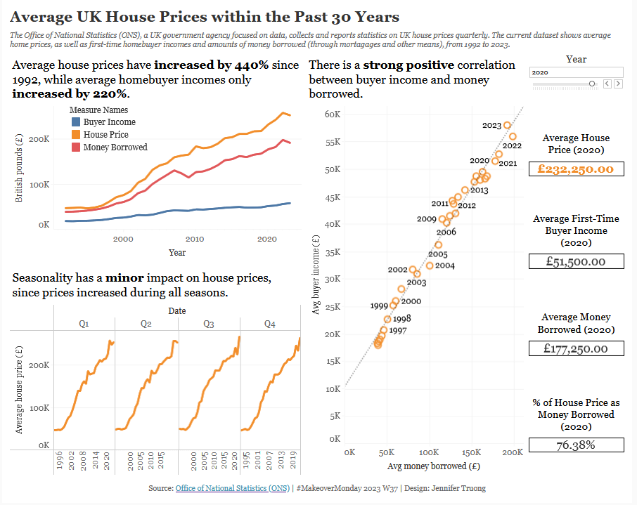

# MakeoverMonday 2023 W37 - Average UK House Prices

## Data Source

The [Office of National Statistics (ONS)](https://www.ons.gov.uk/economy/inflationandpriceindices/datasets/housepriceindexmonthlyquarterlytables1to19) is a UK government agency focused on collecting and publishing data and statistics for the country. They are also in charge of conducting the census in England and Wales every 10 years.

## Questions to Explore

1. How did house prices change over time in the UK?
2. How has seasonality affected home prices over the years?
3. What is the relationship between buyer income and money borrowed? How strong is this relationship?

## Data Cleaning

-  Removed the row for Q1 1992 in Excel since there were nulls for average house price, money borrowed, and buyer income. The cleaned dataset (saved as a CSV) will start at Q2 1992.

## Key Takeaways

- Average house prices have **increased by 440%** since 1992, while average homebuyer incomes only increased by 220%.
- Seasonality has a minor impact on house prices, since home prices show a general increase over time regardless of which quarter is being observed.
- There is a strong positive correlation between buyer income and money borrowed. 

## Data Visualization

Tableau dashboard can be found [here](https://public.tableau.com/shared/SWTT4TNS2?:display_count=n&:origin=viz_share_link).
