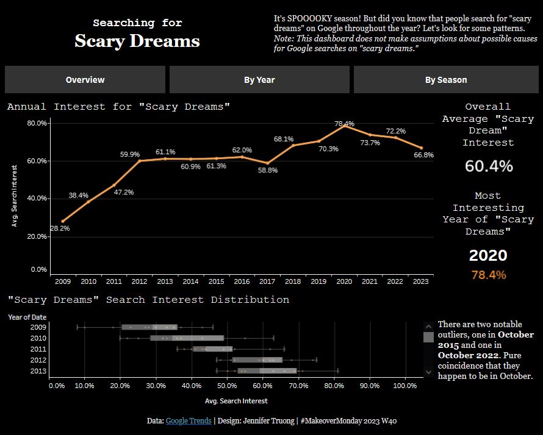

# MakeoverMonday 2023 W40 - Scary Dreams in America

Photo courtesy of Karolina Grabowska from [Pexels](https://www.pexels.com/photo/jack-o-lantern-ghost-5422609/).

## Introduction

It's October, so it's time for the SPOOOKY season. [Google Trends](https://trends.google.com/trends/explore?date=2009-01-01%202023-09-30&geo=US&q=scary%20dreams&hl=en-GB) has a dashboard for tracking searches on the term "scary dreams." Why would someone look up "scary dreams" on Google? Who knows? While we can't make any assumptions, we can still explore interesting trends within Google's data. 

## Data Source

Source: [Google Trends](https://trends.google.com/trends/explore?date=2009-01-01%202023-09-30&geo=US&q=scary%20dreams&hl=en-GB)

__Google's definition of 'interest over time':__
"Numbers represent search interest relative to the highest point on the chart for the given region and time. A value of 100 is the peak popularity for the term. A value of 50 means that the term is half as popular. A score of 0 means that there was not enough data for this term." (Assuming that this variable is measured as a percentage.)

Raw data file: "Scary Dreams.csv" (Note that this data focuses on searches based in the US, ranging from January 2009 to September 2023.)

## Questions to Explore

1. What's the distribution of searches in scary dreams?
2. Does seasonality make an impact in searches for scary dreams?
3. Which year had the most amount of scary dreams?

## Tech Stack

- Microsoft Excel (Power Query)
- Tableau
  
## Data Cleaning

-  Imported data into new Excel Sheet
-  Used Power Query to convert date format to MM/DD/YYYY and rename column names
-  Created several calculated fields on Tableau to do the following aggregations:
    - [group months by season](https://community.tableau.com/s/question/0D54T00000C5qLeSAJ/group-months-by-season)
    - [use LOD expressions to find specific year with max average values](https://kb.tableau.com/articles/howto/finding-the-dimension-member-with-the-highest-measure-value)
- Defined 'seasons' as the following:
    - **Winter:** December, January, February
    - **Spring:** March, April, May
    - **Summer:** June, July, August
    - **Fall:** September, October, November

## Key Takeaways

- Most months have search interest between **55 and 80%** for "scary dreams" (based on intial data exploration).
- The year with the highest "scary dreams" interest was **2020** with **78.4%**.
- The season with the highest "scary dreams" interest was **Fall 2020** with **83.3%**.
- Seasonality may not have a huge impact on search interest compared to year.

## Data Visualization

Tableau dashboard can be found [here](https://public.tableau.com/views/SearchingforScaryDreams-MakeoverMonday/ScaryDreams?:language=en-US&:display_count=n&:origin=viz_share_link).
